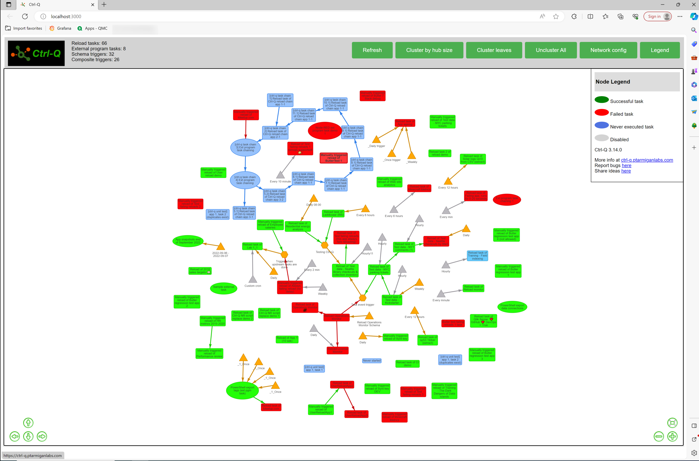
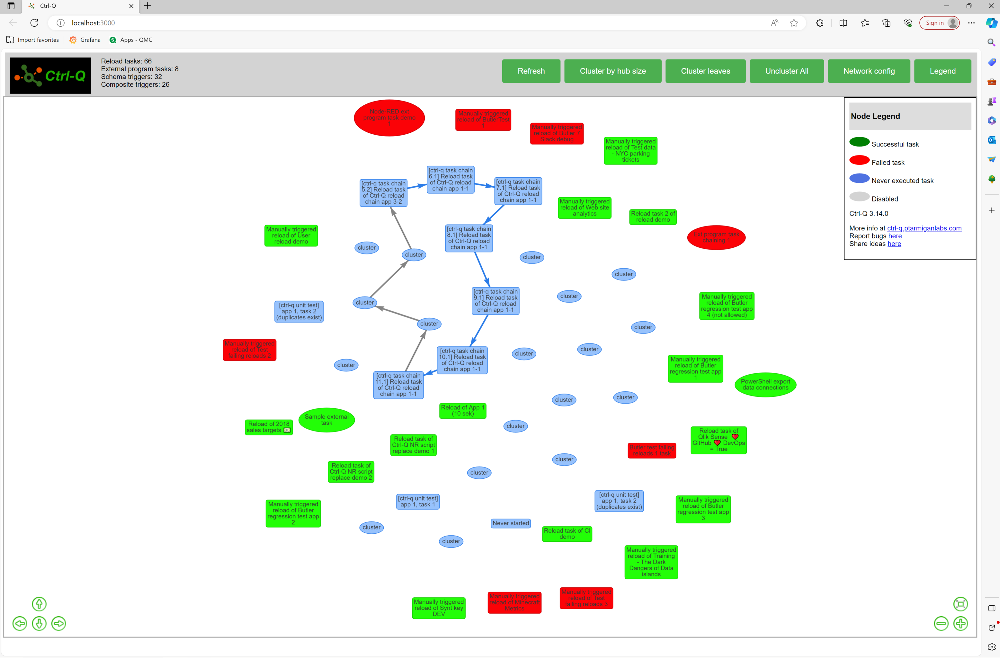
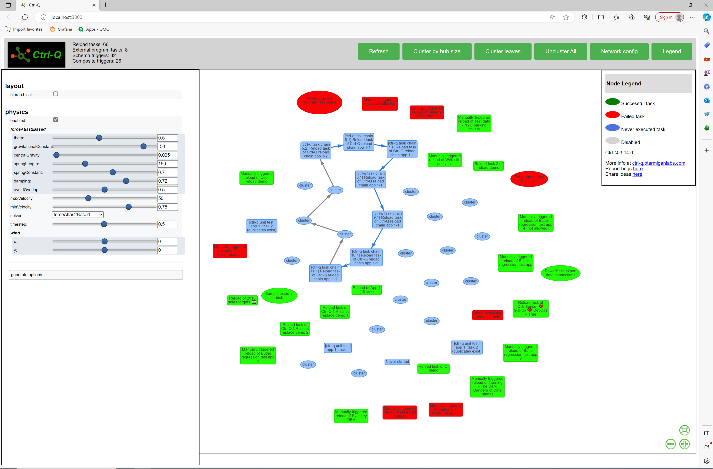

<!-- {} 
This is a placeholder page that shows you how to use this template site.
{} -->

*Page contents:*

- [List tasks as tree](#list-tasks-as-tree)
  - [Syntax](#syntax)
  - [Tree icons](#tree-icons)
  - [Text color](#text-color)
  - [Example: Task tree details](#example-task-tree-details)
  - [Example: Save tree to disk file](#example-save-tree-to-disk-file)
- [List tasks as table](#list-tasks-as-table)
  - [Example: Show task table on screen](#example-show-task-table-on-screen)
  - [Example: Save task to disk file in tabular format](#example-save-task-to-disk-file-in-tabular-format)
  - [Example: Save task to disk file as JSON](#example-save-task-to-disk-file-as-json)
- [List tasks as network graph](#list-tasks-as-network-graph)
  - [Syntax](#syntax-1)
  - [Example](#example)
  - [Node types](#node-types)
  - [User interface](#user-interface)
    - [Collapsing/expanding node clusters](#collapsingexpanding-node-clusters)
    - [Legend and network graph configuration](#legend-and-network-graph-configuration)

---

## List tasks as tree

This command provides a hierarchical tree view of reload tasks and external program tasks, similar to what is available in QlikView.

The tree view can be enhanced with colors (see [this page](/docs/getting-started/colors-formatting/)) and task details.

There are quite a few customisation options available when creating a task tree.  
Note that some options are used when creating task tables, these are not applicable for task trees. Ctrl-Q will show an error when invalid combinations of options are used.

Here [Windows Terminal](https://github.com/microsoft/terminal) is used to run Ctrl-Q.

### Syntax

```text
PS C:\tools\ctrl-q> .\ctrl-q.exe qseow task-get --help
Usage: ctrl-q qseow task-get [options]

get info about one or more tasks

Options:
  --log-level <level>            log level (choices: "error", "warn", "info", "verbose", "debug", "silly", default: "info")
  --host <host>                  Qlik Sense server IP/FQDN
  --port <port>                  Qlik Sense repository service (QRS) port (usually 4242 for cert auth, 443 for jwt auth) (default: "4242")
  --schema-version <string>      Qlik Sense engine schema version (default: "12.612.0")
  --virtual-proxy <prefix>       Qlik Sense virtual proxy prefix (default: "")
  --secure <true|false>          https connection to Qlik Sense must use correct certificate. Invalid certificates will result in rejected/failed connection. (default: true)
  --auth-user-dir <directory>    user directory for user to connect with
  --auth-user-id <userid>        user ID for user to connect with
  -a, --auth-type <type>         authentication type (choices: "cert", "jwt", default: "cert")
  --auth-cert-file <file>        Qlik Sense certificate file (exported from QMC) (default: "./cert/client.pem")
  --auth-cert-key-file <file>    Qlik Sense certificate key file (exported from QMC) (default: "./cert/client_key.pem")
  --auth-root-cert-file <file>   Qlik Sense root certificate file (exported from QMC) (default: "./cert/root.pem")
  --auth-jwt <jwt>               JSON Web Token (JWT) to use for authentication with Qlik Sense server
  --task-type <type...>          type of tasks to include (choices: "reload", "ext-program")
  --task-id <ids...>             use task IDs to select which tasks to retrieve. Only allowed when --output-format=table
  --task-tag <tags...>           use tags to select which tasks to retrieve. Only allowed when --output-format=table
  --output-format <format>       output format (choices: "table", "tree", default: "tree")
  --output-dest <dest>           where to send task info (choices: "screen", "file", default: "screen")
  --output-file-name <name>      file name to store task info in (default: "")
  --output-file-format <format>  file type/format (choices: "excel", "csv", "json", default: "excel")
  --output-file-overwrite        overwrite output file without asking
  --text-color <show>            use colored text in task views (choices: "yes", "no", default: "yes")
  --tree-icons                   display task status icons in tree view
  --tree-details [detail...]     display details for each task in tree view (choices: "taskid", "laststart", "laststop", "nextstart", "appname", "appstream", default: "")
  --table-details [detail...]    which aspects of tasks should be included in table view. Not choosing any details will show all (choices: "common", "lastexecution", "tag", "customproperty", "schematrigger",
                                 "compositetrigger", default: "")
  -h, --help                     display help for command
```

Note:  
Task trees are currently an all-or-nothing feature.  
It is **not** possible to use the `--task-id` or `--task-tag` options when showing task trees.

### Tree icons

If `--tree-icons` is used when starting Ctrl-Q emojis will be used to indicate the last known state for each task.

The used emojis are

|     | Descriptions                                                                                            |
| --- | ------------------------------------------------------------------------------------------------------- |
| ⏰  | Shown at the top of the tree of scheduled tasks. All tasks below this node have a time-based scheduled. |
| ✅  | Finished successfully.                                                                                  |
| ❌  | Failed                                                                                                  |
| 🚫  | Skipped                                                                                                 |
| 🛑  | Aborted                                                                                                 |
| 💤  | Never started                                                                                           |
| ❔  | Unknown                                                                                                 |

### Text color

If `--text-color yes` is specified (`yes` is also the default value) colors will be used to make the created tree more readable.  
`--text-color no` will create a plain-text tree (no colors).

### Example: Task tree details

The `--tree-details` option makes it possible to switch on/off individual task details. This can be useful to make the task tree easier to read.  
The allowed values for this option are `taskid`, `laststart`, `laststop`, `nextstart`, `appname`, `appstream`.

Let's say we want a task tree with the app name and next start time for the task:

```text
.\ctrl-q.exe qseow task-get `
  --auth-type cert `
  --host pro2-win1.lab.ptarmiganlabs.net `
  --auth-user-dir LAB `
  --auth-user-id goran `
  --output-format tree `
  --output-dest screen `
  --tree-icons `
  --text-color yes `
  --tree-details nextstart appname
```

Note how Ctrl-Q detects and warns about cyclic task dependencies:


### Example: Save tree to disk file

Under the hood the task tree is stored as a JSON structure.  
It's possible to save this JSON to disk:

```text
.\ctrl-q.exe qseow task-get `
  --auth-type cert `
  --host pro2-win1.lab.ptarmiganlabs.net `
  --auth-user-dir LAB `
  --auth-user-id goran `
  --output-format tree `
  --output-dest file `
  --tree-details appname `
  --output-file-name tasktree.json `
  --output-file-format json
```

```text
2024-11-15T15:51:37.179Z info: -----------------------------------------------------------
2024-11-15T15:51:37.182Z info: | Ctrl-Q
2024-11-15T15:51:37.182Z info: |
2024-11-15T15:51:37.182Z info: | Version      : 4.0.0
2024-11-15T15:51:37.183Z info: | Log level    : info
2024-11-15T15:51:37.183Z info: |
2024-11-15T15:51:37.183Z info: | Command      : task-get
2024-11-15T15:51:37.183Z info: |              : get info about one or more tasks
2024-11-15T15:51:37.185Z info: |
2024-11-15T15:51:37.185Z info: | Run Ctrl-Q with the '--help' option to see a list of all available options for this command.
2024-11-15T15:51:37.185Z info: |
2024-11-15T15:51:37.185Z info: | https://github.com/ptarmiganlabs/ctrl-q
2024-11-15T15:51:37.186Z info: ----------------------------------------------------------
2024-11-15T15:51:37.186Z info:
2024-11-15T15:51:37.546Z info: Successfully retrieved 29 tags from QSEoW
2024-11-15T15:51:39.840Z warn: Cyclic dependency detected in task tree, from task "[ctrl-q task chain 11.1] Reload task of Ctrl-Q reload chain app 1-1" to "[ctrl-q task chain 2] Reload task of Ctrl-Q reload chain app 2-1". Won't go deeper.
2024-11-15T15:51:39.841Z warn: Cyclic dependency detected in task tree, from task "[ctrl-q task chain 10.1] Reload task of Ctrl-Q reload chain app 1-1" to "[ctrl-q task chain 11.1] Reload task of Ctrl-Q reload chain app 1-1". Won't go deeper.
2024-11-15T15:51:39.843Z info: ✅ Writing task tree to disk file "tasktree.json".
```

Running the same command again, when the destination file already exists, results in a question to overwrite the file:

```text
2024-11-15T15:52:07.252Z info: -----------------------------------------------------------
2024-11-15T15:52:07.254Z info: | Ctrl-Q
2024-11-15T15:52:07.256Z info: |
2024-11-15T15:52:07.256Z info: | Version      : 4.0.0
2024-11-15T15:52:07.256Z info: | Log level    : info
2024-11-15T15:52:07.257Z info: |
2024-11-15T15:52:07.257Z info: | Command      : task-get
2024-11-15T15:52:07.257Z info: |              : get info about one or more tasks
2024-11-15T15:52:07.257Z info: |
2024-11-15T15:52:07.257Z info: | Run Ctrl-Q with the '--help' option to see a list of all available options for this command.
2024-11-15T15:52:07.258Z info: |
2024-11-15T15:52:07.258Z info: | https://github.com/ptarmiganlabs/ctrl-q
2024-11-15T15:52:07.258Z info: ----------------------------------------------------------
2024-11-15T15:52:07.258Z info:
2024-11-15T15:52:07.612Z info: Successfully retrieved 29 tags from QSEoW
2024-11-15T15:52:09.800Z warn: Cyclic dependency detected in task tree, from task "[ctrl-q task chain 11.1] Reload task of Ctrl-Q reload chain app 1-1" to "[ctrl-q task chain 2] Reload task of Ctrl-Q reload chain app 2-1". Won't go deeper.
2024-11-15T15:52:09.800Z warn: Cyclic dependency detected in task tree, from task "[ctrl-q task chain 10.1] Reload task of Ctrl-Q reload chain app 1-1" to "[ctrl-q task chain 11.1] Reload task of Ctrl-Q reload chain app 1-1". Won't go deeper.
2024-11-15T15:52:09.802Z info:
                                  Destination file "tasktree.json" exists. Do you want to overwrite it? (y/n) y
2024-11-15T15:52:10.432Z info:
2024-11-15T15:52:10.432Z info: ✅ Writing task tree to disk file "tasktree.json".
```

To forcibly overwrite the destination file the `--output-file-overwrite` option can be specified.

## List tasks as table

This command provides a tabular view of tasks.  
Tags, custom properties, schedules, triggers and references to other tasks are all included in the table.
This tabular task view can be shown on screen or saved to disk as Excel or CSV files.

The idea is that all information needed to recreate the tasks should be included in the table.  
In reality a few more fields are included, for example app name for the app associated with a task.

The table view can be enhanced with colours (see [this page](/docs/getting-started/colors-formattin)) and task details.

There are quite a few customisation options available when creating a task tree.  
Note that some options are used when creating task tables, these are not applicable for task trees. Ctrl-Q will show an error when invalid combinations of options are used.

### Example: Show task table on screen

Show a list of tasks on screen, including main task fields as well as any tags defined for the tasks.

```text
.\ctrl-q.exe qseow task-get `
  --auth-type cert `
  --host pro2-win1.lab.ptarmiganlabs.net `
  --auth-user-dir LAB `
  --auth-user-id goran `
  --output-format table `
  --output-dest screen `
  --task-type reload ext-program `
  --table-details common tag
```

Note:  
It's possible to get more information about tasks by adding additional values to the `--table-details` option.  
Run `.\ctrl-q.exe task-get --help` to show a complete list of all options and their allowed values.

If `--table-details` is not specified all available information will be showed about the tasks.  
This will result in a *very* wide table!

```text
2024-11-15T15:54:40.045Z info: -----------------------------------------------------------
2024-11-15T15:54:40.049Z info: | Ctrl-Q
2024-11-15T15:54:40.049Z info: |
2024-11-15T15:54:40.049Z info: | Version      : 4.0.0
2024-11-15T15:54:40.050Z info: | Log level    : info
2024-11-15T15:54:40.050Z info: |
2024-11-15T15:54:40.050Z info: | Command      : task-get
2024-11-15T15:54:40.050Z info: |              : get info about one or more tasks
2024-11-15T15:54:40.050Z info: |
2024-11-15T15:54:40.050Z info: | Run Ctrl-Q with the '--help' option to see a list of all available options for this command.
2024-11-15T15:54:40.050Z info: |
2024-11-15T15:54:40.050Z info: | https://github.com/ptarmiganlabs/ctrl-q
2024-11-15T15:54:40.050Z info: ----------------------------------------------------------
2024-11-15T15:54:40.051Z info:
2024-11-15T15:54:40.416Z info: Successfully retrieved 29 tags from QSEoW
2024-11-15T15:54:42.709Z info: # rows in table: 102
2024-11-15T15:54:42.711Z info: # reload tasks in table: 86
2024-11-15T15:54:42.711Z info: # external program tasks in table: 16
2024-11-15T15:54:42.793Z info:
┌──────────────────────────────────────────────────────────────────────────────────────────────────────────────────────────────────────────────────────────────────────────────────────────────────────────────────────────────────────────────────────────────────────────────────────────────────────────────────────────────────────────────────────────────────────────────────────────────────────────────────────────────────────────────────────────────────────────────────┐
│ # reload tasks: 68, # external program tasks: 8, # rows in table: 76

                                                                         │
├──────────────┬──────────────────┬──────────────────────────────────────────────────────────────────────────┬──────────────────────────────────────┬──────────────┬──────────────┬──────────────┬──────────────────────────────────────┬────────────────┬────────────────────┬───────────────────────────────────────────────────────────┬─────────────────────────────────────────────────────────────────────────────┬──────────────────────────────────────────────────────────┤
│ Task counter │ Task type        │ Task name                                                                │ Task id                              │ Task enabled │ Task timeout │ Task retries │ App id                               │ Partial reload │ Manually triggered │ Ext program path                                          │ Ext program parameters
              │ Tags                                                     │
├──────────────┼──────────────────┼──────────────────────────────────────────────────────────────────────────┼──────────────────────────────────────┼──────────────┼──────────────┼──────────────┼──────────────────────────────────────┼────────────────┼────────────────────┼───────────────────────────────────────────────────────────┼─────────────────────────────────────────────────────────────────────────────┼──────────────────────────────────────────────────────────┤
│ 1            │ External program │ App snapshots end of September 2022                                      │ c5cc047d-e520-4ccb-b88f-ac4f9d49d4be │ true         │ 60           │ 1            │                                      │                │                    │ powershell.exe                                            │ -File \\pro2-win1\c$\tools\script\qs_archive_apps_to_stream_end_of_sept.ps1 │                                                          │
├──────────────┼──────────────────┼──────────────────────────────────────────────────────────────────────────┼──────────────────────────────────────┼──────────────┼──────────────┼──────────────┼──────────────────────────────────────┼────────────────┼────────────────────┼───────────────────────────────────────────────────────────┼─────────────────────────────────────────────────────────────────────────────┼──────────────────────────────────────────────────────────┤
│ 2            │ External program │ Ext program task chaining 1                                              │ 4ce41cf3-bc6a-4f66-ad00-ffdeb9a7e468 │ true         │ 15           │ 0            │                                      │                │                    │ powershell.exe                                            │ -File \\pro2-win1\c$\tools\script\ext_task_1.ps1
              │                                                          │
├──────────────┼──────────────────┼──────────────────────────────────────────────────────────────────────────┼──────────────────────────────────────┼──────────────┼──────────────┼──────────────┼──────────────────────────────────────┼────────────────┼────────────────────┼───────────────────────────────────────────────────────────┼─────────────────────────────────────────────────────────────────────────────┼──────────────────────────────────────────────────────────┤
│ 3            │ External program │ Node-RED ext program task demo 1                                         │ d6bfc66a-393b-4eea-8ecd-1b1629c91683 │ true         │ 30           │ 0            │                                      │                │                    │ powershell.exe                                            │
              │ Ctrl-Q demo                                              │
├──────────────┼──────────────────┼──────────────────────────────────────────────────────────────────────────┼──────────────────────────────────────┼──────────────┼──────────────┼──────────────┼──────────────────────────────────────┼────────────────┼────────────────────┼───────────────────────────────────────────────────────────┼─────────────────────────────────────────────────────────────────────────────┼──────────────────────────────────────────────────────────┤
│ 4            │ External program │ PowerShell export data connections                                       │ e7b8d484-5297-4caf-a727-38200905171e │ true         │ 15           │ 1            │                                      │                │                    │ powershell                                                │ -File \\pro2-win1\c$\tools\script\qs_export_data_connections.ps1            │                                                          │
├──────────────┼──────────────────┼──────────────────────────────────────────────────────────────────────────┼──────────────────────────────────────┼──────────────┼──────────────┼──────────────┼──────────────────────────────────────┼────────────────┼────────────────────┼───────────────────────────────────────────────────────────┼─────────────────────────────────────────────────────────────────────────────┼──────────────────────────────────────────────────────────┤
│ 5            │ External program │ PowerShell export tags (ext pgm task)                                    │ 1d5dc4c1-8bd3-455a-9e6a-873da103a950 │ true         │ 15           │ 0            │                                      │                │                    │ powershell                                                │ -File \\pro2-win1\c$\tools\script\qs_export_tags_cps.ps1                    │                                                          │
├──────────────┼──────────────────┼──────────────────────────────────────────────────────────────────────────┼──────────────────────────────────────┼──────────────┼──────────────┼──────────────┼──────────────────────────────────────┼────────────────┼────────────────────┼───────────────────────────────────────────────────────────┼─────────────────────────────────────────────────────────────────────────────┼──────────────────────────────────────────────────────────┤
│ 6            │ External program │ Sample external task                                                     │ 7d4617cd-a9d5-433a-8c82-742e58bfb38b │ true         │ 1440         │ 0            │                                      │                │                    │ C:\Windows\System32\WindowsPowerShell\v1.0\powershell.exe │ -File \\pro2-win1\c$\tools\script\ext_task_1.ps1
              │                                                          │
├──────────────┼──────────────────┼──────────────────────────────────────────────────────────────────────────┼──────────────────────────────────────┼──────────────┼──────────────┼──────────────┼──────────────────────────────────────┼────────────────┼────────────────────┼───────────────────────────────────────────────────────────┼─────────────────────────────────────────────────────────────────────────────┼──────────────────────────────────────────────────────────┤
...
...
```

The `--task-id` and `--task-tag` options take a list of task IDs and tags, respectively.  
When used only the tasks matching the specified task IDs and tags will be included in the created table.  
These options can be used both when showing the task table on screen and when storing it on disk.

Example command using these options. Note the double quotes around the task tags:

```text
.\ctrl-q.exe qseow task-get `
  --auth-type cert `
  --host pro2-win1.lab.ptarmiganlabs.net `
  --auth-user-dir LAB `
  --auth-user-id goran `
  --output-format table `
  --output-dest screen `
  --table-details common tag `
  --task-id e3b27f50-b1c0-4879-88fc-c7cdd9c1cf3e 09b3c78f-04dd-45e3-a4bf-1b074d6572fa `
  --task-tag "Demo apps" "Finance" "Sales forecast"
```

```text
2024-11-15T15:57:58.389Z info: -----------------------------------------------------------
2024-11-15T15:57:58.393Z info: | Ctrl-Q
2024-11-15T15:57:58.393Z info: |
2024-11-15T15:57:58.394Z info: | Version      : 4.0.0
2024-11-15T15:57:58.394Z info: | Log level    : info
2024-11-15T15:57:58.394Z info: |
2024-11-15T15:57:58.395Z info: | Command      : task-get
2024-11-15T15:57:58.395Z info: |              : get info about one or more tasks
2024-11-15T15:57:58.396Z info: |
2024-11-15T15:57:58.397Z info: | Run Ctrl-Q with the '--help' option to see a list of all available options for this command.
2024-11-15T15:57:58.397Z info: |
2024-11-15T15:57:58.397Z info: | https://github.com/ptarmiganlabs/ctrl-q
2024-11-15T15:57:58.397Z info: ----------------------------------------------------------
2024-11-15T15:57:58.398Z info:
2024-11-15T15:57:58.941Z info: Successfully retrieved 29 tags from QSEoW
2024-11-15T15:58:00.533Z info: # rows in table: 1
2024-11-15T15:58:00.533Z info: # reload tasks in table: 1
2024-11-15T15:58:00.533Z info: # external program tasks in table: 0
2024-11-15T15:58:00.548Z info:
┌──────────────────────────────────────────────────────────────────────────────────────────────────────────────────────────────────────────────────────────────────────────────────────────────────────────────────────────────────────────────────────────────────────────────────────────────────────────┐
│ # reload tasks: 1, # external program tasks: 0, # rows in table: 1                                                                                                                                                                                                                                       │
├──────────────┬───────────┬────────────────────────────────────────────────┬──────────────────────────────────────┬──────────────┬──────────────┬──────────────┬──────────────────────────────────────┬────────────────┬────────────────────┬──────────────────┬────────────────────────┬─────────────────┤
│ Task counter │ Task type │ Task name                                      │ Task id                              │ Task enabled │ Task timeout │ Task retries │ App id                               │ Partial reload │ Manually triggered │ Ext program path │ Ext program parameters │ Tags            │
├──────────────┼───────────┼────────────────────────────────────────────────┼──────────────────────────────────────┼──────────────┼──────────────┼──────────────┼──────────────────────────────────────┼────────────────┼────────────────────┼──────────────────┼────────────────────────┼─────────────────┤
│ 1            │ Reload    │ Reload task of Test data - NYC parking tickets │ 09b3c78f-04dd-45e3-a4bf-1b074d6572fa │ true         │ 1440         │ 0            │ 3242f03a-079d-4125-bef2-7b65c9e96231 │                │                    │                  │                        │ Butler 5.0 demo │
└──────────────┴───────────┴────────────────────────────────────────────────┴──────────────────────────────────────┴──────────────┴──────────────┴──────────────┴──────────────────────────────────────┴────────────────┴────────────────────┴──────────────────┴────────────────────────┴─────────────────┘
```

### Example: Save task to disk file in tabular format

Saving a task table to disk file (Excel and CSV file formats supported) is done via the `task-get` command, adding `--output-format table`, `--output-dest file`, `--output-file-format csv` and `--output-file-name <filename>` options.  
Here the most common task fileds together with task tags are included in the table written to a CSV file:

```text
.\ctrl-q.exe qseow task-get `
  --auth-type cert `
  --host pro2-win1.lab.ptarmiganlabs.net `
  --auth-user-dir LAB `
  --auth-user-id goran `
  --output-format table `
  --output-dest file `
  --table-details common tag `
  --output-file-format csv `
  --output-file-name tasktable.csv
```

```text
2024-11-15T15:59:52.405Z info: -----------------------------------------------------------
2024-11-15T15:59:52.408Z info: | Ctrl-Q
2024-11-15T15:59:52.408Z info: |
2024-11-15T15:59:52.408Z info: | Version      : 4.0.0
2024-11-15T15:59:52.408Z info: | Log level    : info
2024-11-15T15:59:52.408Z info: |
2024-11-15T15:59:52.409Z info: | Command      : task-get
2024-11-15T15:59:52.409Z info: |              : get info about one or more tasks
2024-11-15T15:59:52.409Z info: |
2024-11-15T15:59:52.409Z info: | Run Ctrl-Q with the '--help' option to see a list of all available options for this command.
2024-11-15T15:59:52.411Z info: |
2024-11-15T15:59:52.411Z info: | https://github.com/ptarmiganlabs/ctrl-q
2024-11-15T15:59:52.411Z info: ----------------------------------------------------------
2024-11-15T15:59:52.411Z info:
2024-11-15T15:59:52.794Z info: Successfully retrieved 29 tags from QSEoW
2024-11-15T15:59:55.111Z info: ✅ Writing task table to disk file "tasktable.csv".
```

### Example: Save task to disk file as JSON

If task defintions should be read by some other system the task definitions can be saved as JSON.  
Here only the most basic task info included via the `--table-details` option.

```powershell
.\ctrl-q.exe qseow task-get `
  --auth-type cert `
  --host pro2-win1.lab.ptarmiganlabs.net `
  --auth-user-dir LAB `
  --auth-user-id goran `
  --output-format table `
  --output-dest file `
  --table-details common `
  --output-file-format json `
  --output-file-name tasks.json
```

```text
2024-11-15T16:00:47.364Z info: -----------------------------------------------------------
2024-11-15T16:00:47.368Z info: | Ctrl-Q
2024-11-15T16:00:47.368Z info: |
2024-11-15T16:00:47.369Z info: | Version      : 4.0.0
2024-11-15T16:00:47.369Z info: | Log level    : info
2024-11-15T16:00:47.369Z info: |
2024-11-15T16:00:47.369Z info: | Command      : task-get
2024-11-15T16:00:47.369Z info: |              : get info about one or more tasks
2024-11-15T16:00:47.370Z info: |
2024-11-15T16:00:47.370Z info: | Run Ctrl-Q with the '--help' option to see a list of all available options for this command.
2024-11-15T16:00:47.370Z info: |
2024-11-15T16:00:47.371Z info: | https://github.com/ptarmiganlabs/ctrl-q
2024-11-15T16:00:47.371Z info: ----------------------------------------------------------
2024-11-15T16:00:47.371Z info:
2024-11-15T16:00:47.750Z info: Successfully retrieved 29 tags from QSEoW
2024-11-15T16:00:50.125Z info: ✅ Writing task table to disk file "tasks.json".
```

The resulting JSON file looks like this:

```json
[
    [
        "Task counter",
        "Task type",
        "Task name",
        "Task id",
        "Task enabled",
        "Task timeout",
        "Task retries",
        "App id",
        "Partial reload",
        "Manually triggered"
    ],
    [
        1,
        "Reload",
        "Manually triggered reload of Always failing reload (no delay)",
        "0d815a99-1ca3-4131-a398-6878bd735fd8",
        true,
        1440,
        0,
        "deba4bcf-47e4-472e-97b2-4fe8d6498e11",
        false,
        true
    ],
    [
        2,
        "Reload",
        "Manually triggered reload of App1 🏆",
        "b37f8034-faee-4e9b-bbca-5aba0cdf5df2",
        true,
        1440,
        0,
        "26634113-9163-44e4-a879-d87817d6e887",
        false,
        true
    ],
...
...
]
```

## List tasks as network graph

This command provides an interactive network graph view of reload tasks and external program tasks.

First Ctrl-Q will retrieve information about all reload and external program tasks from the Qlik Sense repository service (QRS).  
This includes information about last execution results for the tasks.

A web server is then started on the local computer where Ctrl-Q is running, serving a web page with the network graph in it.  
A link to the web page is shown in the console where Ctrl-Q is running.  
In the example below the link is `http://localhost:3000`.

{}
Graph visualisation of Qlik Sense tasks is a beta feature.

Only a basic set of features are available at this point.  
Performance is ok for small to medium sized Qlik Sense sites, but will slower for larger sites (many hundreds or thousands of tasks).  
{}

### Syntax

```text
PS C:\tools\ctrl-q> .\ctrl-q.exe qseow task-vis --help
Usage: ctrl-q qseow task-vis [options]

visualise task network

Options:
  --log-level <level>           log level (choices: "error", "warn", "info", "verbose", "debug", "silly", default: "info")
  --host <host>                 Qlik Sense server IP/FQDN
  --port <port>                 Qlik Sense repository service (QRS) port (usually 4242 for cert auth, 443 for jwt auth) (default: "4242")
  --virtual-proxy <prefix>      Qlik Sense virtual proxy prefix (default: "")
  --secure <true|false>         https connection to Qlik Sense must use correct certificate. Invalid certificates will result in rejected/failed connection. (default: true)
  --auth-user-dir <directory>   user directory for user to connect with
  --auth-user-id <userid>       user ID for user to connect with
  -a, --auth-type <type>        authentication type (choices: "cert", "jwt", default: "cert")
  --auth-cert-file <file>       Qlik Sense certificate file (exported from QMC) (default: "./cert/client.pem")
  --auth-cert-key-file <file>   Qlik Sense certificate key file (exported from QMC) (default: "./cert/client_key.pem")
  --auth-root-cert-file <file>  Qlik Sense root certificate file (exported from QMC) (default: "./cert/root.pem")
  --auth-jwt <jwt>              JSON Web Token (JWT) to use for authentication with Qlik Sense server
  --vis-host <host>             host for visualisation server (default: "localhost")
  --vis-port <port>             port for visualisation server (default: "3000")
  -h, --help                    display help for command
```

### Example

On Windows using PowerShell it can look like this:

```text
.\ctrl-q.exe qseow task-vis `
  --host pro2-win1.lab.ptarmiganlabs.net `
  --auth-type cert `
  --auth-user-dir LAB `
  --auth-user-id goran
```

```text
2024-11-19T07:10:20.307Z info: -----------------------------------------------------------
2024-11-19T07:10:20.307Z info: | Ctrl-Q
2024-11-19T07:10:20.307Z info: |
2024-11-19T07:10:20.307Z info: | Version      : 4.1.0
2024-11-19T07:10:20.307Z info: | Log level    : info
2024-11-19T07:10:20.307Z info: |
2024-11-19T07:10:20.307Z info: | Command      : task-vis
2024-11-19T07:10:20.307Z info: |              : visualise task network
2024-11-19T07:10:20.307Z info: |
2024-11-19T07:10:20.307Z info: | Run Ctrl-Q with the '--help' option to see a list of all available options for this command.
2024-11-19T07:10:20.307Z info: |
2024-11-19T07:10:20.307Z info: | https://github.com/ptarmiganlabs/ctrl-q
2024-11-19T07:10:20.307Z info: ----------------------------------------------------------
2024-11-19T07:10:20.307Z info:
2024-11-19T07:10:22.439Z info: Using vis.js to visualize tasks, more info at https://github.com/visjs/vis-network
2024-11-19T07:10:22.439Z info:
2024-11-19T07:10:22.439Z info: Task visualization server listening on http://localhost:3000
2024-11-19T07:10:22.439Z info: Press Ctrl-C to quit.
```

Ctrl-clicking (on Windows. Use Cmd-Clik on macOS) on the link will open the network graph in a browser:



### Node types

| Node type | Shape | Description |
| --------- | ----- | ----------- |
| Schema trigger | Triangle | A schema trigger is a time-based task trigger.<br>Orange if enabled, gray when disabled |
| Composite trigger | Hexagon | If a task's composite trigger has two or more upstream triggers the composite trigger will be shown as a hexagon.<br>Orange if enabled, gray when disabled.<br><br>If the composite trigger only has one upstream task the composite trigger will not be shown in the graph. In this case the arrow from the upstream task will go directly to the downstream task. |
| Reload task | Rectangle | A reload task.<br>Green when last reload finished successfully, red when last reload failed, gray when task is disabled, blue when task has never been started. |
| External program task | Elipse | An external program task.<br>Green when last run finished successfully, red when last run failed, gray when task is disabled, blue when task has never been started. |

### User interface

The user interface consists of a toolbar at the top of the page and the network graph itself.

The toolbar has a fixed position and size at the top of the page, while the network graph will resize to fit the available space below the toolbar.

#### Collapsing/expanding node clusters

Networks with many tasks can be hard to read.  
To make it easier to read such networks Ctrl-Q offers the possibility to collapse/expand node clusters and/or leaf nodes.

- A node cluster is a group of nodes that are connected to each other.
- A leaf node is a node that does not have any downstream nodes.

Here is an example where the "Cluster leaves" button has been clicked a few times.  
Note the circular task chain that becomes very easy to see when the leaf nodes are collapsed:



Expanding the leaf nodes again makes is done by clicking the "Uncluster all" button.

#### Legend and network graph configuration

The "Legend" button will toggle the floating (also moveable!) legend window on/off.

The "Network config" button will toggle a network configuration pane to the left on/off:



The network configuration pane makes it possible to fine-tune the parameters used when creating the network graph.  
Things like gravity, spring stiffness, overlap stragegy etc. can be adjusted.

If the network graph is hard to read it can be worth trying different values for these parameters.  

{}
If things don't work out as expected the "Refresh" button in the top toolbar will reload tasks from Qlik Sense and reset all visualisation parameters to their default values.
{}