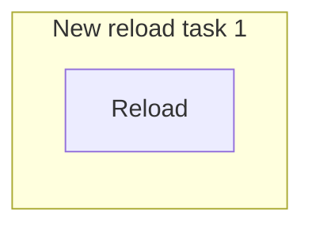
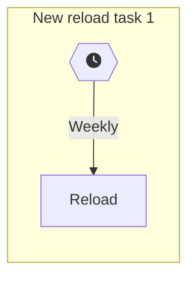
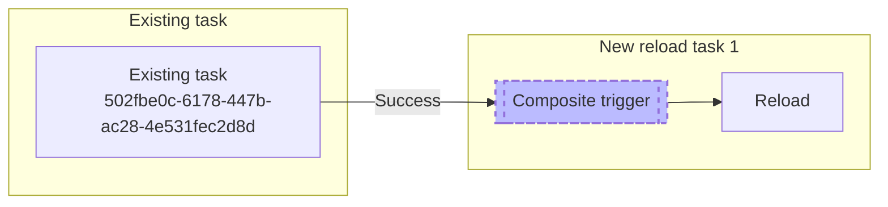
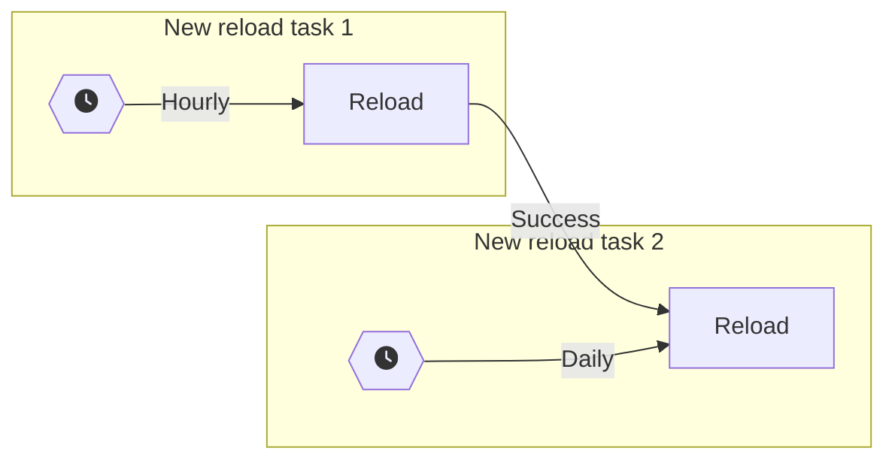
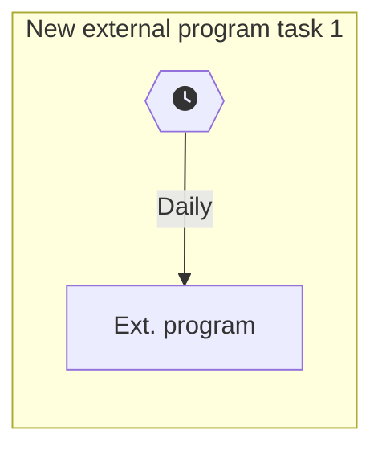
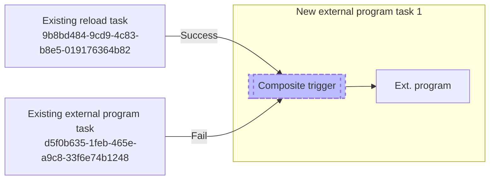

<!-- {} 
This is a placeholder page that shows you how to use this template site.
{} -->

*Page contents:*

- [Task file examples](#task-file-examples)
  - [Example 1: Single reload task with no triggers](#example-1-single-reload-task-with-no-triggers)
  - [Example 2: Single reload task with schema trigger](#example-2-single-reload-task-with-schema-trigger)
  - [Example 3: Single reload task triggered by existing reload task](#example-3-single-reload-task-triggered-by-existing-reload-task)
  - [Example 4: Two reload tasks, one triggering the other](#example-4-two-reload-tasks-one-triggering-the-other)
  - [Example 5: External program task, triggered by schema event](#example-5-external-program-task-triggered-by-schema-event)
  - [Example 6: External program task, triggered by existing tasks](#example-6-external-program-task-triggered-by-existing-tasks)
  - [Example 7: Complex example with multiple tasks and triggers](#example-7-complex-example-with-multiple-tasks-and-triggers)

---

All example below use Windows Terminal/PowerShell.

# Task file examples

The task definition file is a CSV or Excel file that contains all the information needed to create tasks in Sense.  
Below you find increasingly complex examples of how to use the task definition file.

## Example 1: Single reload task with no triggers

One tag, one custom property, no triggers.  
A new task is created.



```
| Task counter | Task type | Task name         | Task id | Task enabled | Task timeout | Task retries | App id                               | Partial reload | Manually triggered | Ext program path | Ext program parameters | Task status | Task started | Task ended | Task duration | Task executedon node | Tags            | Custom properties | Event counter | Event type | Event name | Event enabled | Event created date | Event modified date | Event modified by | Schema increment option | Schema increment description | Daylight savings time | Schema start | Schema expiration | Schema filter description | Schema time zone | Time contstraint seconds | Time contstraint minutes | Time contstraint hours | Time contstraint days | Rule counter | Rule state | Rule task name | Rule task id |
| ------------ | --------- | ----------------- | ------- | ------------ | ------------ | ------------ | ------------------------------------ | -------------- | ------------------ | ---------------- | ---------------------- | ----------- | ------------ | ---------- | ------------- | -------------------- | --------------- | ----------------- | ------------- | ---------- | ---------- | ------------- | ------------------ | ------------------- | ----------------- | ----------------------- | ---------------------------- | --------------------- | ------------ | ----------------- | ------------------------- | ---------------- | ------------------------ | ------------------------ | ---------------------- | --------------------- | ------------ | ---------- | -------------- | ------------ |
| 1            | Reload    | New reload task 1 | task-1  | 1            | 1440         | 0            | 4716f284-7790-45c3-a0a5-154c898766a0 | false          | 1                  |                  |                        |             |              |            | 0:00:00       |                      | Butler 5.0 demo | TaskPriority=High |               |            |            |               |                    |                     |                   |                         |                              |                       |              |                   |                           |                  |                          |                          |                        |                       |              |            |                |              |
```

## Example 2: Single reload task with schema trigger

A single schema trigger called "weekly" is added to the created task.




```
| Task counter | Task type | Task name         | Task id | Task enabled | Task timeout | Task retries | App id                               | Partial reload | Manually triggered | Ext program path | Ext program parameters | Task status | Task started | Task ended | Task duration | Task executedon node | Tags            | Custom properties | Event counter | Event type | Event name | Event enabled | Event created date | Event modified date | Event modified by | Schema increment option | Schema increment description | Daylight savings time | Schema start | Schema expiration | Schema filter description | Schema time zone | Time contstraint seconds | Time contstraint minutes | Time contstraint hours | Time contstraint days | Rule counter | Rule state | Rule task name | Rule task id |
| ------------ | --------- | ----------------- | ------- | ------------ | ------------ | ------------ | ------------------------------------ | -------------- | ------------------ | ---------------- | ---------------------- | ----------- | ------------ | ---------- | ------------- | -------------------- | --------------- | ----------------- | ------------- | ---------- | ---------- | ------------- | ------------------ | ------------------- | ----------------- | ----------------------- | ---------------------------- | --------------------- | ------------ | ----------------- | ------------------------- | ---------------- | ------------------------ | ------------------------ | ---------------------- | --------------------- | ------------ | ---------- | -------------- | ------------ |
| 1            | Reload    | New reload task 1 | task-1  | 1            | 1440         | 0            | 4716f284-7790-45c3-a0a5-154c898766a0 | false          | 1                  |                  |                        |             |              |            | 0:00:00       |                      | Butler 5.0 demo | TaskPriority=High |               |            |            |               |                    |                     |                   |                         |                              |                       |              |                   |                           |                  |                          |                          |                        |                       |              |            |                |              |
| 1            |           |                   |         |              |              |              |                                      |                |                    |                  |                        |             |              |            |               |                      |                 |                   | 1             | Schema     | Weekly     |               |                    |                     | LAB\\goran        | weekly                  | 0 0 1 0                      | ObserveDaylightSavingTime | 2022-10-19T10:19:30.000 | 9999-01-01T00:00:00.000 | * * - 3 1 * * *           | Europe/Paris     |                          |                          |                        |                       |              |            |                |              |
```

## Example 3: Single reload task triggered by existing reload task

The newly created task will be triggered by an already existing task, identified by its task ID.



```
| Task counter | Task type | Task name         | Task id | Task enabled | Task timeout | Task retries | App id                               | Partial reload | Manually triggered | Ext program path | Ext program parameters | Task status | Task started | Task ended | Task duration | Task executedon node | Tags            | Custom properties | Event counter | Event type | Event name           | Event enabled | Event created date | Event modified date | Event modified by | Schema increment option | Schema increment description | Daylight savings time | Schema start | Schema expiration | Schema filter description | Schema time zone | Time contstraint seconds | Time contstraint minutes | Time contstraint hours | Time contstraint days | Rule counter | Rule state     | Rule task name                                    | Rule task id                         |
| ------------ | --------- | ----------------- | ------- | ------------ | ------------ | ------------ | ------------------------------------ | -------------- | ------------------ | ---------------- | ---------------------- | ----------- | ------------ | ---------- | ------------- | -------------------- | --------------- | ----------------- | ------------- | ---------- | -------------------- | ------------- | ------------------ | ------------------- | ----------------- | ----------------------- | ---------------------------- | --------------------- | ------------ | ----------------- | ------------------------- | ---------------- | ------------------------ | ------------------------ | ---------------------- | --------------------- | ------------ | -------------- | ------------------------------------------------- | ------------------------------------ |
| 1            | Reload    | New reload task 1 | task-1  | 1            | 1440         | 0            | 4716f284-7790-45c3-a0a5-154c898766a0 | 0              | 1                  |                  |                        |             |              |            | 0:00:00       |                      | Butler 5.0 demo | TaskPriority=High |               |            |                      |               |                    |                     |                   |                         |                              |                       |              |                   |                           |                  |                          |                          |                        |                       |              |                |                                                   |                                      |
| 1            |           |                   |         |              |              |              |                                      |                |                    |                  |                        |             |              |            |               |                      |                 |                   | 1             | Composite  | When HR metrics done | 1             |                    |                     | LAB\\goran        |                         |                              |                       |              |                   |                           |                  | 0                        | 360                      | 0                      | 0                     |              |                |                                                   |                                      |
| 1            |           |                   |         |              |              |              |                                      |                |                    |                  |                        |             |              |            |               |                      |                 |                   | 1             |            |                      |               |                    |                     |                   |                         |                              |                       |              |                   |                           |                  |                          |                          |                        |                       | 1            | TaskSuccessful | Manually triggered reload of HR metrics 2015-2020 | 6a42a7d0-bee9-4609-b340-8c8c50b3c4d9 |
|              |           |                   |         |              |              |              |                                      |                |                    |                  |                        |             |              |            |               |                      |                 |                   |               |            |                      |               |                    |                     |                   |                         |                              |                       |              |                   |                           |                  |                          |                          |                        |                       |              |                |                                                   |                                      |
```

## Example 4: Two reload tasks, one triggering the other

Two new tasks are created.

- The first task is triggered by an hourly schema trigger.
- The second is triggered by successful completion of the first one, plus a daily schema trigger.



```
| Task counter | Task type | Task name         | Task id | Task enabled | Task timeout | Task retries | App id                               | Partial reload | Manually triggered | Ext program path | Ext program parameters | Task status | Task started | Task ended | Task duration | Task executedon node | Tags            | Custom properties | Event counter | Event type | Event name              | Event enabled | Event created date | Event modified date | Event modified by | Schema increment option | Schema increment description | Daylight savings time     | Schema start            | Schema expiration       | Schema filter description | Schema time zone | Time contstraint seconds | Time contstraint minutes | Time contstraint hours | Time contstraint days | Rule counter | Rule state     | Rule task name | Rule task id |
| ------------ | --------- | ----------------- | ------- | ------------ | ------------ | ------------ | ------------------------------------ | -------------- | ------------------ | ---------------- | ---------------------- | ----------- | ------------ | ---------- | ------------- | -------------------- | --------------- | ----------------- | ------------- | ---------- | ----------------------- | ------------- | ------------------ | ------------------- | ----------------- | ----------------------- | ---------------------------- | ------------------------- | ----------------------- | ----------------------- | ------------------------- | ---------------- | ------------------------ | ------------------------ | ---------------------- | --------------------- | ------------ | -------------- | -------------- | ------------ |
| 1            | Reload    | New reload task 1 | task-1  | 1            | 1440         | 0            | 4716f284-7790-45c3-a0a5-154c898766a0 | 0              | 1                  |                  |                        |             |              |            | 0:00:00       |                      | Butler 5.0 demo | TaskPriority=High |               |            |                         |               |                    |                     |                   |                         |                              |                           |                         |                         |                           |                  |                          |                          |                        |                       |              |                |                |              |
| 1            |           |                   |         |              |              |              |                                      |                |                    |                  |                        |             |              |            |               |                      |                 |                   | 1             | Schema     | Hourly                  |               |                    |                     | LAB\\goran        | hourly                  | 30 0 0 0                     | ObserveDaylightSavingTime | 2021-12-08T14:21:49.000 | 9999-01-01T00:00:00.000 | * * - * * * * *           | Europe/Paris     |                          |                          |                        |                       |              |                |                |              |
| 2            | Reload    | New reload task 2 | task-2  | 1            | 1440         | 0            | df013a07-d219-46c8-8d32-09b87fd87553 | 0              | 1                  |                  |                        |             |              |            | 0:00:00       |                      | Butler 5.0 demo | TaskPriority=High |               |            |                         |               |                    |                     |                   |                         |                              |                           |                         |                         |                           |                  |                          |                          |                        |                       |              |                |                |              |
| 2            |           |                   |         |              |              |              |                                      |                |                    |                  |                        |             |              |            |               |                      |                 |                   | 1             | Schema     | Daily                   | 1             |                    |                     | LAB\\goran        | daily                   | 0 0 1 0                      | ObserveDaylightSavingTime | 2022-10-17T11:37:26.000 | 9999-01-01T00:00:00.000 | * * - * * * * *           | Europe/Paris     |                          |                          |                        |                       |              |                |                |              |
| 2            |           |                   |         |              |              |              |                                      |                |                    |                  |                        |             |              |            |               |                      |                 |                   | 1             | Composite  | When reload task 1 done | 1             |                    |                     | LAB\\goran        |                         |                              |                           |                         |                         |                           |                  | 0                        | 360                      | 0                      | 0                     |              |                |                |              |
| 2            |           |                   |         |              |              |              |                                      |                |                    |                  |                        |             |              |            |               |                      |                 |                   | 1             |            |                         |               |                    |                     |                   |                         |                              |                           |                         |                         |                           |                  |                          |                          |                        |                       | 1            | TaskSuccessful |                | task-1       |
```

## Example 5: External program task, triggered by schema event



```
| Task counter | Task type        | Task name                   | Task id | Task enabled | Task timeout | Task retries | App id | Partial reload | Manually triggered | Ext program path                                               | Ext program parameters                                 | Task status | Task started | Task ended | Task duration | Task executedon node | Tags | Custom properties                     | Event counter | Event type | Event name | Event enabled | Event created date | Event modified date | Event modified by | Schema increment option | Schema increment description | Daylight savings time     | Schema start            | Schema expiration       | Schema filter description | Schema time zone | Time contstraint seconds | Time contstraint minutes | Time contstraint hours | Time contstraint days | Rule counter | Rule state | Rule task name | Rule task id |
| ------------ | ---------------- | --------------------------- | ------- | ------------ | ------------ | ------------ | ------ | -------------- | ------------------ | -------------------------------------------------------------- | ------------------------------------------------------ | ----------- | ------------ | ---------- | ------------- | -------------------- | ---- | ------------------------------------- | ------------- | ---------- | ---------- | ------------- | ------------------ | ------------------- | ----------------- | ----------------------- | ---------------------------- | ------------------------- | ----------------------- | ----------------------- | ------------------------- | ---------------- | ------------------------ | ------------------------ | ---------------------- | --------------------- | ------------ | ---------- | -------------- | ------------ |
| 1            | External program | New external program task 1 | task-1  | 1            | 1440         | 3            |        |                |                    | C:\\Windows\\System32\\WindowsPowerShell\\v1.0\\powershell.exe | -File \\\\pro2-win1\\c$\\tools\\script\\ext_task_1.ps1 |             |              |            | 0:00:00       |                      | api1 | Department=Finance / Department=Sales |               |            |            |               |                    |                     |                   |                         |                              |                           |                         |                         |                           |                  |                          |                          |                        |                       |              |            |                |              |
| 1            |                  |                             |         |              |              |              |        |                |                    |                                                                |                                                        |             |              |            |               |                      |      |                                       | 1             | Schema     | Daily      |               |                    |                     | LAB\\goran        | daily                   | 0 0 1 0                      | ObserveDaylightSavingTime | 2020-05-31T20:34:18.000 | 9999-01-01T00:00:00.000 | * * - * * * * *           | Europe/Paris     |                          |                          |                        |                       |              |            |                |              |
```

## Example 6: External program task, triggered by existing tasks



```
| Task counter | Task type        | Task name                   | Task id | Task enabled | Task timeout | Task retries | App id | Partial reload | Manually triggered | Ext program path                                               | Ext program parameters                                 | Task status | Task started | Task ended | Task duration | Task executedon node | Tags | Custom properties                     | Event counter | Event type | Event name                           | Event enabled | Event created date | Event modified date | Event modified by | Schema increment option | Schema increment description | Daylight savings time | Schema start | Schema expiration | Schema filter description | Schema time zone | Time contstraint seconds | Time contstraint minutes | Time contstraint hours | Time contstraint days | Rule counter | Rule state     | Rule task name | Rule task id                         |
| ------------ | ---------------- | --------------------------- | ------- | ------------ | ------------ | ------------ | ------ | -------------- | ------------------ | -------------------------------------------------------------- | ------------------------------------------------------ | ----------- | ------------ | ---------- | ------------- | -------------------- | ---- | ------------------------------------- | ------------- | ---------- | ------------------------------------ | ------------- | ------------------ | ------------------- | ----------------- | ----------------------- | ---------------------------- | --------------------- | ------------ | ----------------- | ------------------------- | ---------------- | ------------------------ | ------------------------ | ---------------------- | --------------------- | ------------ | -------------- | -------------- | ------------------------------------ |
| 1            | External program | New external program task 1 | task-1  | 1            | 1440         | 3            |        |                |                    | C:\\Windows\\System32\\WindowsPowerShell\\v1.0\\powershell.exe | -File \\\\pro2-win1\\c$\\tools\\script\\ext_task_1.ps1 |             |              |            | 0:00:00       |                      | api1 | Department=Finance / Department=Sales |               |            |                                      |               |                    |                     |                   |                         |                              |                       |              |                   |                           |                  |                          |                          |                        |                       |              |                |                |                                      |
| 1            |                  |                             |         |              |              |              |        |                |                    |                                                                |                                                        |             |              |            |               |                      |      |                                       | 2             | Composite  | Trigger when upstream tasks are done |               |                    |                     | LAB\\goran        |                         |                              |                       |              |                   |                           |                  | 0                        | 360                      | 0                      | 0                     |              |                |                |                                      |
| 1            |                  |                             |         |              |              |              |        |                |                    |                                                                |                                                        |             |              |            |               |                      |      |                                       | 2             |            |                                      |               |                    |                     |                   |                         |                              |                       |              |                   |                           |                  |                          |                          |                        |                       | 1            | TaskSuccessful |                | 9b8bd484-9cd9-4c83-b8e5-019176364b82 |
| 1            |                  |                             |         |              |              |              |        |                |                    |                                                                |                                                        |             |              |            |               |                      |      |                                       | 2             |            |                                      |               |                    |                     |                   |                         |                              |                       |              |                   |                           |                  |                          |                          |                        |                       | 2            | TaskFail       |                | d5f0b635-1feb-465e-a9c8-33f6e74b1248 |
```

## Example 7: Complex example with multiple tasks and triggers

Note that some composite trigger rules (the ones with UUIDs in them) refer to tasks that already exist in Sense, and some (e.g. "task-2") refer to tasks that are defined in the task definition file itself.

The flowchart becomes quite complex for this example:

```mermaid
---
Complex example with multiple tasks and triggers
---
flowchart TD
  subgraph New external program task 1
    6751615b-4627-4d86-bd7e-d6bc1f4a81be["Ext. program"]
  end
  subgraph Ext program task chaining 1
    d30b7f54-1b24-4eb0-befc-e97ad7f0daa6["Ext. program"]
  end
  
  subgraph Ext task 1
    6097da0e-50d8-4c0f-b442-49739b556180["Ext. program"]
    A{{"fa:fa-clock"}} -- Weekly --> 6097da0e-50d8-4c0f-b442-49739b556180

    6097da0e-50d8-4c0f-b442-49739b556180_ct_1[["Composite trigger"]]
    style 6097da0e-50d8-4c0f-b442-49739b556180_ct_1 fill:#bbf,stroke-width:2px,stroke-dasharray: 5 5
    
    6097da0e-50d8-4c0f-b442-49739b556180_ct_1 --> 6097da0e-50d8-4c0f-b442-49739b556180
  end

  subgraph Ext task 2
    78db1ac3-0035-4b5c-bf35-14e1cbd2b0bf["Ext. program"]

    78db1ac3-0035-4b5c-bf35-14e1cbd2b0bf_ct_1[["Composite trigger"]]
    style 78db1ac3-0035-4b5c-bf35-14e1cbd2b0bf_ct_1 fill:#bbf,stroke-width:2px,stroke-dasharray: 5 5
    
    B{{"fa:fa-clock"}} -- Weekly --> 78db1ac3-0035-4b5c-bf35-14e1cbd2b0bf
    78db1ac3-0035-4b5c-bf35-14e1cbd2b0bf_ct_1 --> 78db1ac3-0035-4b5c-bf35-14e1cbd2b0bf
  end
  
  subgraph "[ctrl-q task chain 3] Ext program task chaining"
    166e2d6a-89c4-4021-a04d-01c8c20f1cfa["Ext. program"]

    166e2d6a-89c4-4021-a04d-01c8c20f1cfa_ct_1[["Composite trigger"]]
    style 166e2d6a-89c4-4021-a04d-01c8c20f1cfa_ct_1 fill:#bbf,stroke-width:2px,stroke-dasharray: 5 5
    166e2d6a-89c4-4021-a04d-01c8c20f1cfa_ct_1 --> 166e2d6a-89c4-4021-a04d-01c8c20f1cfa
  end

  subgraph "[ctrl-q task chain 4] Ext program task chaining"
    afc250bc-28c3-49a2-8d63-80966749abe3["Ext. program"]

    afc250bc-28c3-49a2-8d63-80966749abe3_ct_1[["Composite trigger"]]
    style afc250bc-28c3-49a2-8d63-80966749abe3_ct_1 fill:#bbf,stroke-width:2px,stroke-dasharray: 5 5
    afc250bc-28c3-49a2-8d63-80966749abe3_ct_1 --> afc250bc-28c3-49a2-8d63-80966749abe3
  end

  subgraph "Butler test failing reloads 1 task"
    3920e8d7-8109-446f-8bb3-5464df03facc["Reload"]
  end

  subgraph "Reload task of Lab 1_1"
    30c6a76a-ece6-4a4a-b476-56155a5a85b8["Reload"]

    30c6a76a-ece6-4a4a-b476-56155a5a85b8_schema_1{{"fa:fa-clock"}} -- Daily --> 30c6a76a-ece6-4a4a-b476-56155a5a85b8
    30c6a76a-ece6-4a4a-b476-56155a5a85b8_schema_2{{"fa:fa-clock"}} -- Custom cron --> 30c6a76a-ece6-4a4a-b476-56155a5a85b8

    30c6a76a-ece6-4a4a-b476-56155a5a85b8_ct_1[["Composite trigger"]]
    style 30c6a76a-ece6-4a4a-b476-56155a5a85b8_ct_1 fill:#bbf,stroke-width:2px,stroke-dasharray: 5 5
    30c6a76a-ece6-4a4a-b476-56155a5a85b8_ct_1 --> 30c6a76a-ece6-4a4a-b476-56155a5a85b8
  end

  subgraph "[ctrl-q task chain 1] Reload task of Ctrl-Q reload chain app 1-1"
    ece63341-7d57-4093-b972-fd130c2290e7["Reload"]
  end

  subgraph "[ctrl-q task chain 2] Reload task of Ctrl-Q reload chain app 2-1"
    ad188c0e-f196-449d-9662-f33998f56b78["Reload"]

    ad188c0e-f196-449d-9662-f33998f56b78_ct_1[["Composite trigger"]]
    style ad188c0e-f196-449d-9662-f33998f56b78_ct_1 fill:#bbf,stroke-width:2px,stroke-dasharray: 5 5
    ad188c0e-f196-449d-9662-f33998f56b78_ct_1 --> ad188c0e-f196-449d-9662-f33998f56b78
  end

  subgraph "[ctrl-q task chain 5.1] Reload task of Ctrl-Q reload chain app 3-1"
    2e549e47-13e7-4f02-91c2-34f7bf3d57eb["Reload"]

    2e549e47-13e7-4f02-91c2-34f7bf3d57eb_ct_1[["Composite trigger"]]
    style 2e549e47-13e7-4f02-91c2-34f7bf3d57eb_ct_1 fill:#bbf,stroke-width:2px,stroke-dasharray: 5 5
    2e549e47-13e7-4f02-91c2-34f7bf3d57eb_ct_1 --> 2e549e47-13e7-4f02-91c2-34f7bf3d57eb
  end

  subgraph "[ctrl-q task chain 5.2] Reload task of Ctrl-Q reload chain app 3-2"
    f402f48a-8590-4fc1-bf5e-ae30b4d9f2eb["Reload"]

    f402f48a-8590-4fc1-bf5e-ae30b4d9f2eb_ct_1[["Composite trigger"]]
    style f402f48a-8590-4fc1-bf5e-ae30b4d9f2eb_ct_1 fill:#bbf,stroke-width:2px,stroke-dasharray: 5 5
    f402f48a-8590-4fc1-bf5e-ae30b4d9f2eb_ct_1 --> f402f48a-8590-4fc1-bf5e-ae30b4d9f2eb
  end

  subgraph "[ctrl-q task chain 6.1] Reload task of Ctrl-Q reload chain app 1-1"
    c7f83305-6fd5-4926-bc1f-abfc05d0729c["Reload"]

    c7f83305-6fd5-4926-bc1f-abfc05d0729c_ct_1[["Composite trigger"]]
    style c7f83305-6fd5-4926-bc1f-abfc05d0729c_ct_1 fill:#bbf,stroke-width:2px,stroke-dasharray: 5 5
    c7f83305-6fd5-4926-bc1f-abfc05d0729c_ct_1 --> c7f83305-6fd5-4926-bc1f-abfc05d0729c
  end

  subgraph "[ctrl-q task chain 7.1] Reload task of Ctrl-Q reload chain app 1-1"
    b9532a39-a69f-4857-acc1-4762a90fd784["Reload"]

    b9532a39-a69f-4857-acc1-4762a90fd784_ct_1[["Composite trigger"]]
    style b9532a39-a69f-4857-acc1-4762a90fd784_ct_1 fill:#bbf,stroke-width:2px,stroke-dasharray: 5 5
    b9532a39-a69f-4857-acc1-4762a90fd784_ct_1 --> b9532a39-a69f-4857-acc1-4762a90fd784
  end

  subgraph "[ctrl-q task chain 8.1] Reload task of Ctrl-Q reload chain app 1-1"
    ad6114d8-9b79-4342-8d2d-b9565506ec1a["Reload"]

    ad6114d8-9b79-4342-8d2d-b9565506ec1a_ct_1[["Composite trigger"]]
    style ad6114d8-9b79-4342-8d2d-b9565506ec1a_ct_1 fill:#bbf,stroke-width:2px,stroke-dasharray: 5 5
    ad6114d8-9b79-4342-8d2d-b9565506ec1a_ct_1 --> ad6114d8-9b79-4342-8d2d-b9565506ec1a
  end

  subgraph "[ctrl-q task chain 9.1] Reload task of Ctrl-Q reload chain app 1-1"
    5b1cdbe5-58a9-4743-ba3f-68a5dc772391["Reload"]

    5b1cdbe5-58a9-4743-ba3f-68a5dc772391_ct_1[["Composite trigger"]]
    style 5b1cdbe5-58a9-4743-ba3f-68a5dc772391_ct_1 fill:#bbf,stroke-width:2px,stroke-dasharray: 5 5
    5b1cdbe5-58a9-4743-ba3f-68a5dc772391_ct_1 --> 5b1cdbe5-58a9-4743-ba3f-68a5dc772391
  end

  subgraph "[ctrl-q task chain 10.1] Reload task of Ctrl-Q reload chain app 1-1"
    08e2cbca-0687-4c96-8914-dbb0e6515b1f["Reload"]

    08e2cbca-0687-4c96-8914-dbb0e6515b1f_ct_1[["Composite trigger"]]
    style 08e2cbca-0687-4c96-8914-dbb0e6515b1f_ct_1 fill:#bbf,stroke-width:2px,stroke-dasharray: 5 5
    08e2cbca-0687-4c96-8914-dbb0e6515b1f_ct_1 --> 08e2cbca-0687-4c96-8914-dbb0e6515b1f
  end

  subgraph "[ctrl-q task chain 11.1] Reload task of Ctrl-Q reload chain app 1-1"
    63206b08-516c-4e43-8fc9-2e47581d0b1a["Reload"]

    63206b08-516c-4e43-8fc9-2e47581d0b1a_ct_1[["Composite trigger"]]
    style 63206b08-516c-4e43-8fc9-2e47581d0b1a_ct_1 fill:#bbf,stroke-width:2px,stroke-dasharray: 5 5
    63206b08-516c-4e43-8fc9-2e47581d0b1a_ct_1 --> 63206b08-516c-4e43-8fc9-2e47581d0b1a
  end


  77f11a41-af3a-4bca-bf67-725be92a88f6[Existing task 77f11a41-af3a-4bca-bf67-725be92a88f6]
  bea1f18f-b476-4d8e-b9d4-640fe62fbe8a[Existing task bea1f18f-b476-4d8e-b9d4-640fe62fbe8a]
  8b4fe424-d90c-493f-a61d-0ce91cd485c9[Existing task 8b4fe424-d90c-493f-a61d-0ce91cd485c9]
  30f8a2e9-f0d3-482e-af58-aed6b77d3dd5[Existing task 30f8a2e9-f0d3-482e-af58-aed6b77d3dd5]

  77f11a41-af3a-4bca-bf67-725be92a88f6 -- Success --> 6097da0e-50d8-4c0f-b442-49739b556180_ct_1
  bea1f18f-b476-4d8e-b9d4-640fe62fbe8a -- Fail --> 6097da0e-50d8-4c0f-b442-49739b556180_ct_1
  8b4fe424-d90c-493f-a61d-0ce91cd485c9 -- Success --> 6097da0e-50d8-4c0f-b442-49739b556180_ct_1
  30f8a2e9-f0d3-482e-af58-aed6b77d3dd5 -- Success ---> 6097da0e-50d8-4c0f-b442-49739b556180_ct_1
  afc250bc-28c3-49a2-8d63-80966749abe3 -- Success ---> 6097da0e-50d8-4c0f-b442-49739b556180_ct_1

  6097da0e-50d8-4c0f-b442-49739b556180 -- Success --> 78db1ac3-0035-4b5c-bf35-14e1cbd2b0bf_ct_1

  ad188c0e-f196-449d-9662-f33998f56b78 -- Success --> 166e2d6a-89c4-4021-a04d-01c8c20f1cfa_ct_1

  166e2d6a-89c4-4021-a04d-01c8c20f1cfa -- Success--> afc250bc-28c3-49a2-8d63-80966749abe3_ct_1

  77f11a41-af3a-4bca-bf67-725be92a88f6 -- Success ---> 30c6a76a-ece6-4a4a-b476-56155a5a85b8_ct_1
  bea1f18f-b476-4d8e-b9d4-640fe62fbe8a -- Fail ---> 30c6a76a-ece6-4a4a-b476-56155a5a85b8_ct_1
  8b4fe424-d90c-493f-a61d-0ce91cd485c9 -- Success ---> 30c6a76a-ece6-4a4a-b476-56155a5a85b8_ct_1
  30f8a2e9-f0d3-482e-af58-aed6b77d3dd5 -- Success ---> 30c6a76a-ece6-4a4a-b476-56155a5a85b8_ct_1
  afc250bc-28c3-49a2-8d63-80966749abe3 -- Success ---> 30c6a76a-ece6-4a4a-b476-56155a5a85b8_ct_1
  
  5b1cdbe5-58a9-4743-ba3f-68a5dc772391 -- Success --> 08e2cbca-0687-4c96-8914-dbb0e6515b1f_ct_1

  08e2cbca-0687-4c96-8914-dbb0e6515b1f -- Success --> 63206b08-516c-4e43-8fc9-2e47581d0b1a_ct_1

  ece63341-7d57-4093-b972-fd130c2290e7 -- Success --> ad188c0e-f196-449d-9662-f33998f56b78_ct_1

  afc250bc-28c3-49a2-8d63-80966749abe3 -- Success --> 2e549e47-13e7-4f02-91c2-34f7bf3d57eb_ct_1

  afc250bc-28c3-49a2-8d63-80966749abe3 -- Success --> f402f48a-8590-4fc1-bf5e-ae30b4d9f2eb_ct_1

  f402f48a-8590-4fc1-bf5e-ae30b4d9f2eb -- Success --> c7f83305-6fd5-4926-bc1f-abfc05d0729c_ct_1

  c7f83305-6fd5-4926-bc1f-abfc05d0729c -- Success --> b9532a39-a69f-4857-acc1-4762a90fd784_ct_1

  b9532a39-a69f-4857-acc1-4762a90fd784 -- Success --> ad6114d8-9b79-4342-8d2d-b9565506ec1a_ct_1

  ad6114d8-9b79-4342-8d2d-b9565506ec1a -- Success --> 5b1cdbe5-58a9-4743-ba3f-68a5dc772391_ct_1
```






  The "Rule task name" field for composite trigger rules can contain any information.

  It is not used when determining which upstream task the task should be triggered by, but it is convenient to have a human-readable name there.


```
| Task counter | Task type        | Task name                                                           | Task id        | Task enabled | Task timeout | Task retries | App id                               | Partial reload | Manually triggered | Ext program path                                               | Ext program parameters                                 | Task status    | Task started             | Task ended               | Task duration | Task executedon node            | Tags                     | Custom properties                                                      | Event counter | Event type | Event name                             | Event enabled | Event created date   | Event modified date | Event modified by | Schema increment option | Schema increment description | Daylight savings time     | Schema start            | Schema expiration       | Schema filter description | Schema time zone | Time contstraint seconds | Time contstraint minutes | Time contstraint hours | Time contstraint days | Rule counter | Rule state     | Rule task name                                                      | Rule task id                         |
| ------------ | ---------------- | ------------------------------------------------------------------- | -------------- | ------------ | ------------ | ------------ | ------------------------------------ | -------------- | ------------------ | -------------------------------------------------------------- | ------------------------------------------------------ | -------------- | ------------------------ | ------------------------ | ------------- | ------------------------------- | ------------------------ | ---------------------------------------------------------------------- | ------------- | ---------- | -------------------------------------- | ------------- | -------------------- | ------------------- | ----------------- | ----------------------- | ---------------------------- | ------------------------- | ----------------------- | ----------------------- | ------------------------- | ---------------- | ------------------------ | ------------------------ | ---------------------- | --------------------- | ------------ | -------------- | ------------------------------------------------------------------- | ------------------------------------ |
| 1            | External program | New external program task 1                                         | task-1         | 1            | 1440         | 3            |                                      |                |                    | C:\\Windows\\System32\\WindowsPowerShell\\v1.0\\powershell.exe | -File \\\\pro2-win1\\c$\\tools\\script\\ext_task_1.ps1 |                |                          |                          | 0:00:00       |                                 | api1                     | Department=Finance / Department=Sales                                  |               |            |                                        |               |                      |                     |                   |                         |                              |                           |                         |                         |                           |                  |                          |                          |                        |                       |              |                |                                                                     |                                      |
| 2            | External program | Ext program task chaining 1                                         | task-2         | 1            | 15           | 0            |                                      |                |                    | powershell.exe                                                 | -File \\\\pro2-win1\\c$\\tools\\script\\ext_task_1.ps1 |                | 2023-09-26T05:58:55.590Z | 2023-09-26T06:23:38.346Z | 0:24:42       | pro2-win1.lab.ptarmiganlabs.net |                          |                                                                        |               |            |                                        |               |                      |                     |                   |                         |                              |                           |                         |                         |                           |                  |                          |                          |                        |                       |              |                |                                                                     |                                      |
| 3            | External program | Ext task 1                                                          | task-3         | 1            | 1440         | 3            |                                      |                |                    | C:\\Windows\\System32\\WindowsPowerShell\\v1.0\\powershell.exe | -File \\\\pro2-win1\\c$\\tools\\script\\ext_task_1.ps1 |                |                          |                          | 0:00:00       |                                 | api1                     | Department=Finance / Department=Sales                                  |               |            |                                        |               |                      |                     |                   |                         |                              |                           |                         |                         |                           |                  |                          |                          |                        |                       |              |                |                                                                     |                                      |
| 3            |                  |                                                                     |                |              |              |              |                                      |                |                    |                                                                |                                                        |                |                          |                          |               |                                 |                          |                                                                        | 1             | Schema     | Weekly                                 |               |                      |                     |                   | weekly                  | 0 0 1 0                      | ObserveDaylightSavingTime | 2022-10-19T10:19:30.000 | 9999-01-01T00:00:00.000 | * * - 3 1 * * *           | Europe/Paris     |                          |                          |                        |                       |              |                |                                                                     |                                      |
| 3            |                  |                                                                     |                |              |              |              |                                      |                |                    |                                                                |                                                        |                |                          |                          |               |                                 |                          |                                                                        | 2             | Composite  | 2 Trigger when upstream tasks are done |               |                      |                     |                   |                         |                              |                           |                         |                         |                           |                  | 0                        | 360                      | 0                      | 0                     |              |                |                                                                     |                                      |
| 3            |                  |                                                                     |                |              |              |              |                                      |                |                    |                                                                |                                                        |                |                          |                          |               |                                 |                          |                                                                        | 2             |            |                                        |               |                      |                     |                   |                         |                              |                           |                         |                         |                           |                  |                          |                          |                        |                       | 1            | TaskSuccessful | Manually triggered reload of Butler 7 Slack debug                   | 77f11a41-af3a-4bca-bf67-725be92a88f6 |
| 3            |                  |                                                                     |                |              |              |              |                                      |                |                    |                                                                |                                                        |                |                          |                          |               |                                 |                          |                                                                        | 2             |            |                                        |               |                      |                     |                   |                         |                              |                           |                         |                         |                           |                  |                          |                          |                        |                       | 2            | TaskFail       | Manually triggered reload of App1 🏆                                 | bea1f18f-b476-4d8e-b9d4-640fe62fbe8a |
| 3            |                  |                                                                     |                |              |              |              |                                      |                |                    |                                                                |                                                        |                |                          |                          |               |                                 |                          |                                                                        | 2             |            |                                        |               |                      |                     |                   |                         |                              |                           |                         |                         |                           |                  |                          |                          |                        |                       | 3            | TaskSuccessful | Reload task of EV chargers                                          | 8b4fe424-d90c-493f-a61d-0ce91cd485c9 |
| 3            |                  |                                                                     |                |              |              |              |                                      |                |                    |                                                                |                                                        |                |                          |                          |               |                                 |                          |                                                                        | 2             |            |                                        |               |                      |                     |                   |                         |                              |                           |                         |                         |                           |                  |                          |                          |                        |                       | 4            | TaskSuccessful | Reload task of Residential energy analysis                          | 30f8a2e9-f0d3-482e-af58-aed6b77d3dd5 |
| 3            |                  |                                                                     |                |              |              |              |                                      |                |                    |                                                                |                                                        |                |                          |                          |               |                                 |                          |                                                                        | 2             |            |                                        |               |                      |                     |                   |                         |                              |                           |                         |                         |                           |                  |                          |                          |                        |                       | 5            | TaskSuccessful | [ctrl-q task chain 4] Ext program task chaining                     | special-task-1                       |
| 4            | External program | Ext task 2                                                          | task-4         | 1            | 1440         | 3            |                                      |                |                    | C:\\Windows\\System32\\WindowsPowerShell\\v1.0\\powershell.exe | -File \\\\pro2-win1\\c$\\tools\\script\\ext_task_1.ps1 |                |                          |                          | 0:00:00       |                                 |                          |                                                                        |               |            |                                        |               |                      |                     |                   |                         |                              |                           |                         |                         |                           |                  |                          |                          |                        |                       |              |                |                                                                     |                                      |
| 4            |                  |                                                                     |                |              |              |              |                                      |                |                    |                                                                |                                                        |                |                          |                          |               |                                 |                          |                                                                        | 1             | Schema     | Weekly                                 |               |                      |                     |                   | weekly                  | 0 0 1 0                      | ObserveDaylightSavingTime | 2022-10-19T10:19:30.000 | 9999-01-01T00:00:00.000 | * * - 3 1 * * *           | Europe/Paris     |                          |                          |                        |                       |              |                |                                                                     |                                      |
| 4            |                  |                                                                     |                |              |              |              |                                      |                |                    |                                                                |                                                        |                |                          |                          |               |                                 |                          |                                                                        | 2             | Composite  | 2 Trigger when upstream tasks are done |               |                      |                     |                   |                         |                              |                           |                         |                         |                           |                  | 0                        | 360                      | 0                      | 0                     |              |                |                                                                     |                                      |
| 4            |                  |                                                                     |                |              |              |              |                                      |                |                    |                                                                |                                                        |                |                          |                          |               |                                 |                          |                                                                        | 2             |            |                                        |               |                      |                     |                   |                         |                              |                           |                         |                         |                           |                  |                          |                          |                        |                       | 1            | TaskSuccessful | Ext task 1                                                          | task-3                               |
| 5            | External program | [ctrl-q task chain 3] Ext program task chaining                     | task-5         | 1            | 1440         | 0            |                                      |                |                    | powershell.exe                                                 | -File \\\\pro2-win1\\c$\\tools\\script\\ext_task_1.ps1 |                |                          |                          | 0:00:00       |                                 |                          |                                                                        |               |            |                                        |               |                      |                     |                   |                         |                              |                           |                         |                         |                           |                  |                          |                          |                        |                       |              |                |                                                                     |                                      |
| 5            |                  |                                                                     |                |              |              |              |                                      |                |                    |                                                                |                                                        |                |                          |                          |               |                                 |                          |                                                                        | 1             | Composite  | When [ctrl-q 2] done                   | 1             |                      |                     |                   |                         |                              |                           |                         |                         |                           |                  | 0                        | 360                      | 0                      | 0                     |              |                |                                                                     |                                      |
| 5            |                  |                                                                     |                |              |              |              |                                      |                |                    |                                                                |                                                        |                |                          |                          |               |                                 |                          |                                                                        | 1             |            |                                        |               |                      |                     |                   |                         |                              |                           |                         |                         |                           |                  |                          |                          |                        |                       | 1            | TaskSuccessful | [ctrl-q task chain 2] Reload task of Ctrl-Q reload chain app 2-1    | task-9                               |
| 6            | External program | [ctrl-q task chain 4] Ext program task chaining                     | special-task-1 | 1            | 1440         | 0            |                                      |                |                    | powershell.exe                                                 | -File \\\\pro2-win1\\c$\\tools\\script\\ext_task_1.ps1 |                |                          |                          | 0:00:00       |                                 |                          |                                                                        |               |            |                                        |               |                      |                     |                   |                         |                              |                           |                         |                         |                           |                  |                          |                          |                        |                       |              |                |                                                                     |                                      |
| 6            |                  |                                                                     |                |              |              |              |                                      |                |                    |                                                                |                                                        |                |                          |                          |               |                                 |                          |                                                                        | 1             | Composite  | When [ctrl-q task chain 3] done        | 1             |                      |                     |                   |                         |                              |                           |                         |                         |                           |                  | 0                        | 360                      | 0                      | 0                     |              |                |                                                                     |                                      |
| 6            |                  |                                                                     |                |              |              |              |                                      |                |                    |                                                                |                                                        |                |                          |                          |               |                                 |                          |                                                                        | 1             |            |                                        |               |                      |                     |                   |                         |                              |                           |                         |                         |                           |                  |                          |                          |                        |                       | 1            | TaskSuccessful | [ctrl-q task chain 3] Ext program task chaining                     | task-5                               |
| 7            | Reload           | Butler test failing reloads 1 task                                  |                | 1            | 1440         | 0            | 4788dc51-2bf6-45f0-a4ad-8bd8d40e1d3f |                | 1                  |                                                                |                                                        |                | 2023-11-09T08:43:06.081Z | 2023-11-09T08:43:33.079Z | 0:00:26       | pro2-win1.lab.ptarmiganlabs.net | startTask1 / Ctrl-Q demo | Butler_AbortedAlertEnableEmail=Yes / Butler_FailedAlertEnableEmail=Yes |               |            |                                        |               |                      |                     |                   |                         |                              |                           |                         |                         |                           |                  |                          |                          |                        |                       |              |                |                                                                     |                                      |
| 8            | Reload           | Reload task of Lab 1_1                                              |                | 1            | 1440         | 3            | 4716f284-7790-45c3-a0a5-154c898766a0 |                |                    |                                                                |                                                        |                |                          |                          | 0:00:00       |                                 | api1                     | Department=Finance / Department=Sales                                  |               |            |                                        |               |                      |                     |                   |                         |                              |                           |                         |                         |                           |                  |                          |                          |                        |                       |              |                |                                                                     |                                      |
| 8            |                  |                                                                     |                |              |              |              |                                      |                |                    |                                                                |                                                        |                |                          |                          |               |                                 |                          |                                                                        | 1             | Schema     | Daily                                  | 1             |                      |                     |                   | daily                   | 0 0 1 0                      | ObserveDaylightSavingTime | 2022-10-17T11:37:26.000 | 9999-01-01T00:00:00.000 | * * - * * * * *           | Europe/Paris     |                          |                          |                        |                       |              |                |                                                                     |                                      |
| 8            |                  |                                                                     |                |              |              |              |                                      |                |                    |                                                                |                                                        |                |                          |                          |               |                                 |                          |                                                                        | 2             | Schema     | Custom cron                            |               |                      |                     |                   | custom                  | 1 2 3 4                      | ObserveDaylightSavingTime | 2022-10-17T11:37:29.000 | 9999-01-01T00:00:00.000 | * * - * * * * *           | Europe/Paris     |                          |                          |                        |                       |              |                |                                                                     |                                      |
| 8            |                  |                                                                     |                |              |              |              |                                      |                |                    |                                                                |                                                        |                |                          |                          |               |                                 |                          |                                                                        | 3             | Composite  | Trigger when upstream tasks are done   |               |                      |                     |                   |                         |                              |                           |                         |                         |                           |                  | 0                        | 360                      | 0                      | 0                     |              |                |                                                                     |                                      |
| 8            |                  |                                                                     |                |              |              |              |                                      |                |                    |                                                                |                                                        |                |                          |                          |               |                                 |                          |                                                                        | 3             |            |                                        |               |                      |                     |                   |                         |                              |                           |                         |                         |                           |                  |                          |                          |                        |                       | 1            | TaskSuccessful | Manually triggered reload of Butler 7 Slack debug                   | 77f11a41-af3a-4bca-bf67-725be92a88f6 |
| 8            |                  |                                                                     |                |              |              |              |                                      |                |                    |                                                                |                                                        |                |                          |                          |               |                                 |                          |                                                                        | 3             |            |                                        |               |                      |                     |                   |                         |                              |                           |                         |                         |                           |                  |                          |                          |                        |                       | 2            | TaskFail       | Manually triggered reload of App1 🏆                                 | bea1f18f-b476-4d8e-b9d4-640fe62fbe8a |
| 8            |                  |                                                                     |                |              |              |              |                                      |                |                    |                                                                |                                                        |                |                          |                          |               |                                 |                          |                                                                        | 3             |            |                                        |               |                      |                     |                   |                         |                              |                           |                         |                         |                           |                  |                          |                          |                        |                       | 3            | TaskSuccessful | Reload task of EV chargers                                          | 8b4fe424-d90c-493f-a61d-0ce91cd485c9 |
| 8            |                  |                                                                     |                |              |              |              |                                      |                |                    |                                                                |                                                        |                |                          |                          |               |                                 |                          |                                                                        | 3             |            |                                        |               |                      |                     |                   |                         |                              |                           |                         |                         |                           |                  |                          |                          |                        |                       | 4            | TaskSuccessful | Reload task of Residential energy analysis                          | 30f8a2e9-f0d3-482e-af58-aed6b77d3dd5 |
| 8            |                  |                                                                     |                |              |              |              |                                      |                |                    |                                                                |                                                        |                |                          |                          |               |                                 |                          |                                                                        | 3             |            |                                        |               |                      |                     |                   |                         |                              |                           |                         |                         |                           |                  |                          |                          |                        |                       | 5            | TaskSuccessful | [ctrl-q task chain 4] Ext program task chaining                     | special-task-1                       |
| 9            | Reload           | [ctrl-q task chain 10.1] Reload task of Ctrl-Q reload chain app 1-1 | task-6         | 1            | 1440         | 0            | 3d711d07-c133-48f7-ab26-8350c5b8fe2e |                |                    |                                                                |                                                        |                |                          |                          | 0:00:00       |                                 |                          |                                                                        |               |            |                                        |               |                      |                     |                   |                         |                              |                           |                         |                         |                           |                  |                          |                          |                        |                       |              |                |                                                                     |                                      |
| 9            |                  |                                                                     |                |              |              |              |                                      |                |                    |                                                                |                                                        |                |                          |                          |               |                                 |                          |                                                                        | 1             | Composite  | ...                                    | 1             |                      |                     |                   |                         |                              |                           |                         |                         |                           |                  | 0                        | 360                      | 0                      | 0                     |              |                |                                                                     |                                      |
| 9            |                  |                                                                     |                |              |              |              |                                      |                |                    |                                                                |                                                        |                |                          |                          |               |                                 |                          |                                                                        | 1             |            |                                        |               |                      |                     |                   |                         |                              |                           |                         |                         |                           |                  |                          |                          |                        |                       | 1            | TaskSuccessful | [ctrl-q task chain 9.1] Reload task of Ctrl-Q reload chain app 1-1  | task-15                              |
| 10           | Reload           | [ctrl-q task chain 11.1] Reload task of Ctrl-Q reload chain app 1-1 | task-7         | 1            | 1440         | 0            | 3d711d07-c133-48f7-ab26-8350c5b8fe2e |                |                    |                                                                |                                                        |                |                          |                          | 0:00:00       |                                 |                          |                                                                        |               |            |                                        |               |                      |                     |                   |                         |                              |                           |                         |                         |                           |                  |                          |                          |                        |                       |              |                |                                                                     |                                      |
| 10           |                  |                                                                     |                |              |              |              |                                      |                |                    |                                                                |                                                        |                |                          |                          |               |                                 |                          |                                                                        | 1             | Composite  | ...                                    | 1             |                      |                     |                   |                         |                              |                           |                         |                         |                           |                  | 0                        | 360                      | 0                      | 0                     |              |                |                                                                     |                                      |
| 10           |                  |                                                                     |                |              |              |              |                                      |                |                    |                                                                |                                                        |                |                          |                          |               |                                 |                          |                                                                        | 1             |            |                                        |               |                      |                     |                   |                         |                              |                           |                         |                         |                           |                  |                          |                          |                        |                       | 1            | TaskSuccessful | [ctrl-q task chain 10.1] Reload task of Ctrl-Q reload chain app 1-1 | task-6                               |
| 11           | Reload           | [ctrl-q task chain 1] Reload task of Ctrl-Q reload chain app 1-1    | task-8         | 1            | 1440         | 0            | 3d711d07-c133-48f7-ab26-8350c5b8fe2e |                |                    |                                                                |                                                        |                |                          |                          | 0:00:00       |                                 |                          |                                                                        |               |            |                                        |               |                      |                     |                   |                         |                              |                           |                         |                         |                           |                  |                          |                          |                        |                       |              |                |                                                                     |                                      |
| 12           | Reload           | [ctrl-q task chain 2] Reload task of Ctrl-Q reload chain app 2-1    | task-9         | 1            | 1440         | 0            | 766c96a8-d8ba-47e6-b4a3-e1935bf12d99 |                |                    |                                                                |                                                        |                |                          |                          | 0:00:00       |                                 |                          |                                                                        |               |            |                                        |               |                      |                     |                   |                         |                              |                           |                         |                         |                           |                  |                          |                          |                        |                       |              |                |                                                                     |                                      |
| 12           |                  |                                                                     |                |              |              |              |                                      |                |                    |                                                                |                                                        |                |                          |                          |               |                                 |                          |                                                                        | 1             | Composite  | When Ctrl-Q [1] done                   | 1             |                      |                     |                   |                         |                              |                           |                         |                         |                           |                  | 0                        | 360                      | 0                      | 0                     |              |                |                                                                     |                                      |
| 12           |                  |                                                                     |                |              |              |              |                                      |                |                    |                                                                |                                                        |                |                          |                          |               |                                 |                          |                                                                        | 1             |            |                                        |               |                      |                     |                   |                         |                              |                           |                         |                         |                           |                  |                          |                          |                        |                       | 1            | TaskSuccessful | [ctrl-q task chain 1] Reload task of Ctrl-Q reload chain app 1-1    | task-8                               |
| 13           | Reload           | [ctrl-q task chain 5.1] Reload task of Ctrl-Q reload chain app 3-1  | task-10        | 1            | 1440         | 0            | aea0ac54-b377-4325-a1f7-e32a5616ff95 |                |                    |                                                                |                                                        |                |                          |                          | 0:00:00       |                                 |                          |                                                                        |               |            |                                        |               |                      |                     |                   |                         |                              |                           |                         |                         |                           |                  |                          |                          |                        |                       |              |                |                                                                     |                                      |
| 13           |                  |                                                                     |                |              |              |              |                                      |                |                    |                                                                |                                                        |                |                          |                          |               |                                 |                          |                                                                        | 1             | Composite  | When Ctrl-q [4] done                   | 1             |                      |                     |                   |                         |                              |                           |                         |                         |                           |                  | 0                        | 360                      | 0                      | 0                     |              |                |                                                                     |                                      |
| 13           |                  |                                                                     |                |              |              |              |                                      |                |                    |                                                                |                                                        |                |                          |                          |               |                                 |                          |                                                                        | 1             |            |                                        |               |                      |                     |                   |                         |                              |                           |                         |                         |                           |                  |                          |                          |                        |                       | 1            | TaskSuccessful | [ctrl-q task chain 4] Ext program task chaining                     | special-task-1                       |
| 14           | Reload           | [ctrl-q task chain 5.2] Reload task of Ctrl-Q reload chain app 3-2  | task-11        | 1            | 1440         | 0            | 972da501-93f7-470d-b8ba-84ef2cfebdc9 |                |                    |                                                                |                                                        |                |                          |                          | 0:00:00       |                                 |                          |                                                                        |               |            |                                        |               |                      |                     |                   |                         |                              |                           |                         |                         |                           |                  |                          |                          |                        |                       |              |                |                                                                     |                                      |
| 14           |                  |                                                                     |                |              |              |              |                                      |                |                    |                                                                |                                                        |                |                          |                          |               |                                 |                          |                                                                        | 1             | Composite  | When Ctrl-q [4] done                   | 1             |                      |                     |                   |                         |                              |                           |                         |                         |                           |                  | 0                        | 360                      | 0                      | 0                     |              |                |                                                                     |                                      |
| 14           |                  |                                                                     |                |              |              |              |                                      |                |                    |                                                                |                                                        |                |                          |                          |               |                                 |                          |                                                                        | 1             |            |                                        |               |                      |                     |                   |                         |                              |                           |                         |                         |                           |                  |                          |                          |                        |                       | 1            | TaskSuccessful | [ctrl-q task chain 4] Ext program task chaining                     | special-task-1                       |
| 15           | Reload           | [ctrl-q task chain 6.1] Reload task of Ctrl-Q reload chain app 1-1  | task-12        | 1            | 1440         | 0            | 3d711d07-c133-48f7-ab26-8350c5b8fe2e |                |                    |                                                                |                                                        |                |                          |                          | 0:00:00       |                                 |                          |                                                                        |               |            |                                        |               |                      |                     |                   |                         |                              |                           |                         |                         |                           |                  |                          |                          |                        |                       |              |                |                                                                     |                                      |
| 15           |                  |                                                                     |                |              |              |              |                                      |                |                    |                                                                |                                                        |                |                          |                          |               |                                 |                          |                                                                        | 1             | Composite  | ...                                    | 1             |                      |                     |                   |                         |                              |                           |                         |                         |                           |                  | 0                        | 360                      | 0                      | 0                     |              |                |                                                                     |                                      |
| 15           |                  |                                                                     |                |              |              |              |                                      |                |                    |                                                                |                                                        |                |                          |                          |               |                                 |                          |                                                                        | 1             |            |                                        |               |                      |                     |                   |                         |                              |                           |                         |                         |                           |                  |                          |                          |                        |                       | 1            | TaskSuccessful | [ctrl-q task chain 5.2] Reload task of Ctrl-Q reload chain app 3-2  | task-11                              |
| 16           | Reload           | [ctrl-q task chain 7.1] Reload task of Ctrl-Q reload chain app 1-1  | task-13        | 1            | 1440         | 0            | 3d711d07-c133-48f7-ab26-8350c5b8fe2e |                |                    |                                                                |                                                        |                |                          |                          | 0:00:00       |                                 |                          |                                                                        |               |            |                                        |               |                      |                     |                   |                         |                              |                           |                         |                         |                           |                  |                          |                          |                        |                       |              |                |                                                                     |                                      |
| 16           |                  |                                                                     |                |              |              |              |                                      |                |                    |                                                                |                                                        |                |                          |                          |               |                                 |                          |                                                                        | 1             | Composite  | ...                                    | 1             |                      |                     |                   |                         |                              |                           |                         |                         |                           |                  | 0                        | 360                      | 0                      | 0                     |              |                |                                                                     |                                      |
| 16           |                  |                                                                     |                |              |              |              |                                      |                |                    |                                                                |                                                        |                |                          |                          |               |                                 |                          |                                                                        | 1             |            |                                        |               |                      |                     |                   |                         |                              |                           |                         |                         |                           |                  |                          |                          |                        |                       | 1            | TaskSuccessful | [ctrl-q task chain 6.1] Reload task of Ctrl-Q reload chain app 1-1  | task-12                              |
| 17           | Reload           | [ctrl-q task chain 8.1] Reload task of Ctrl-Q reload chain app 1-1  | task-14        | 1            | 1440         | 0            | 3d711d07-c133-48f7-ab26-8350c5b8fe2e |                |                    |                                                                |                                                        |                |                          |                          | 0:00:00       |                                 |                          |                                                                        |               |            |                                        |               |                      |                     |                   |                         |                              |                           |                         |                         |                           |                  |                          |                          |                        |                       |              |                |                                                                     |                                      |
| 17           |                  |                                                                     |                |              |              |              |                                      |                |                    |                                                                |                                                        |                |                          |                          |               |                                 |                          |                                                                        | 1             | Composite  | ...                                    | 1             |                      |                     |                   |                         |                              |                           |                         |                         |                           |                  | 0                        | 360                      | 0                      | 0                     |              |                |                                                                     |                                      |
| 17           |                  |                                                                     |                |              |              |              |                                      |                |                    |                                                                |                                                        |                |                          |                          |               |                                 |                          |                                                                        | 1             |            |                                        |               |                      |                     |                   |                         |                              |                           |                         |                         |                           |                  |                          |                          |                        |                       | 1            | TaskSuccessful | [ctrl-q task chain 7.1] Reload task of Ctrl-Q reload chain app 1-1  | task-13                              |
| 18           | Reload           | [ctrl-q task chain 9.1] Reload task of Ctrl-Q reload chain app 1-1  | task-15        | 1            | 1440         | 0            | 3d711d07-c133-48f7-ab26-8350c5b8fe2e |                |                    |                                                                |                                                        |                |                          |                          | 0:00:00       |                                 |                          |                                                                        |               |            |                                        |               |                      |                     |                   |                         |                              |                           |                         |                         |                           |                  |                          |                          |                        |                       |              |                |                                                                     |                                      |
| 18           |                  |                                                                     |                |              |              |              |                                      |                |                    |                                                                |                                                        |                |                          |                          |               |                                 |                          |                                                                        | 1             | Composite  | ...                                    | 1             |                      |                     |                   |                         |                              |                           |                         |                         |                           |                  | 0                        | 360                      | 0                      | 0                     |              |                |                                                                     |                                      |
| 18           |                  |                                                                     |                |              |              |              |                                      |                |                    |                                                                |                                                        |                |                          |                          |               |                                 |                          |                                                                        | 1             |            |                                        |               |                      |                     |                   |                         |                              |                           |                         |                         |                           |                  |                          |                          |                        |                       | 1            | TaskSuccessful | [ctrl-q task chain 8.1] Reload task of Ctrl-Q reload chain app 1-1  | task-14                              |
```
